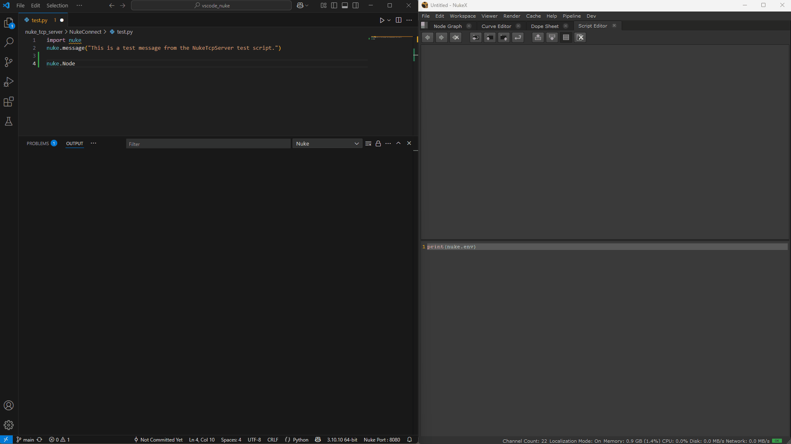
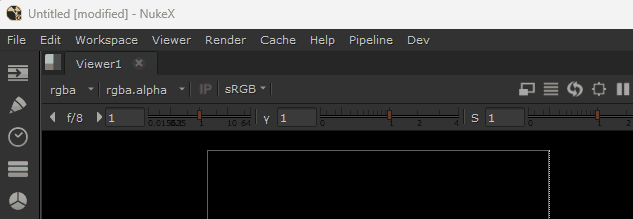
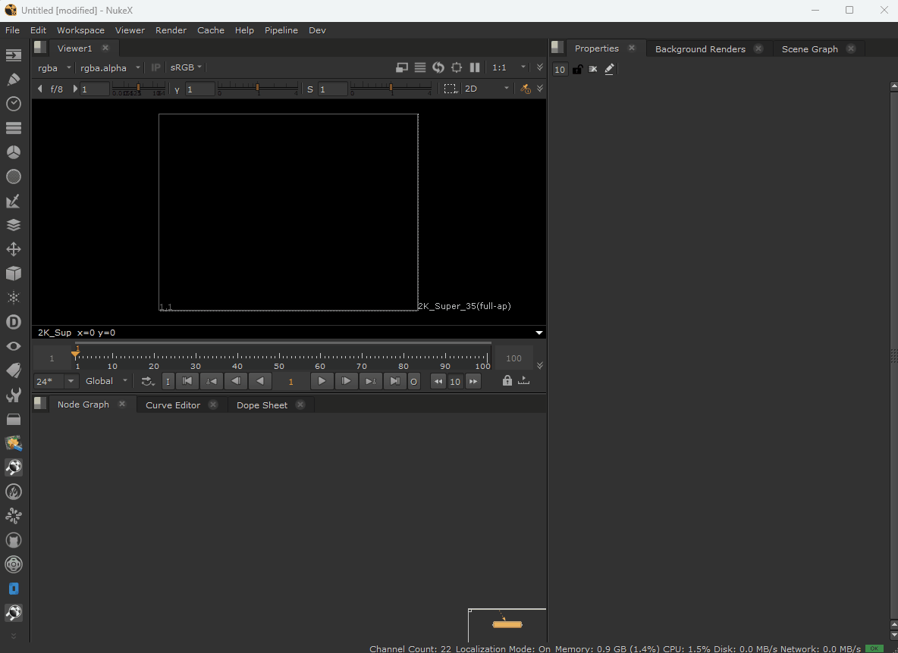

# VSCode Nuke Connect
This is a simple extension for sending code from vscode to Nuke.\
It requires both an extension loaded into VSCode and an addon installed into Nuke, both are included.\

This implementation is based on [vscode-blender](https://github.com/minimalefforttech/vscode_blender_port/).



# Installation

## Installing the Nuke Python Addon

- Go to your user `.nuke/menu.py` file and add this code:
  ```Python
  import sys
  sys.path.append("pathToRepo/vscode_nuke/nuke_tcp_server")
  import NukeConnect
  ```
- Restard Nuke

Once installed, you will have a custom dev menu in Nuke with a ´Nuke Connect´ command that indicates the status of the Nuke tcp server.



You can click in the menu to turn On/Off the Nuke tcp server.

Also you will have new custom preferences to disable auto start of the server on Nuke opening and modify the tcp port.





# Building the extension manually

## Prerequisites

- **Node.js & npm**: Download and install from [https://nodejs.org/](https://nodejs.org/)
- **vsce (Visual Studio Code Extension Manager)**: Install globally with  
  ```
  npm install -g @vscode/vsce
  ```

## Building the VSCode Extension

To build the VSCode extension, follow these steps:

1. Navigate to the `vscode_extension` directory.
2. Run `npm install` to install the necessary dependencies.
3. Run `vsce package` to compile the extension.
4. Install with `code --install-extension nukeconnect-{version}.vsix`  
   Or navigate to it via the extension browser.