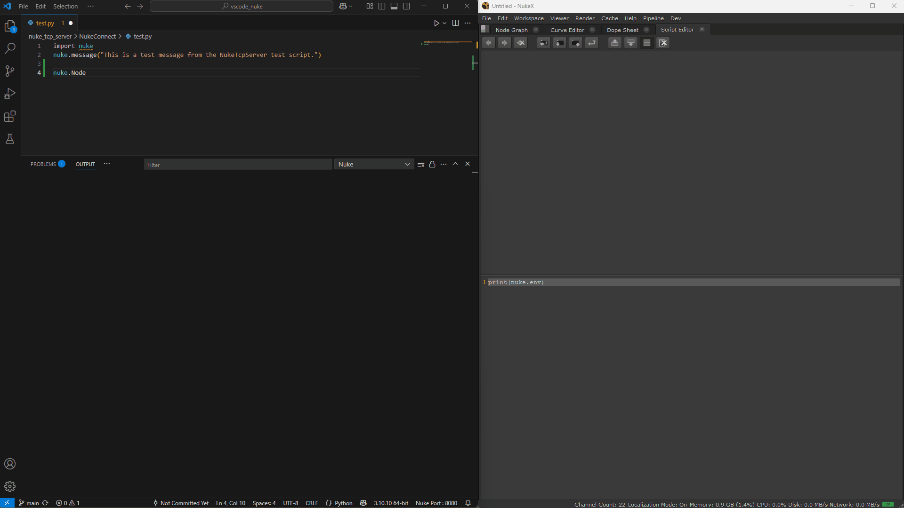

# Send to Nuke VSCode Extension

Send Python code from Visual Studio Code directly to Nuke for rapid prototyping and development.

## Features

- Send selected Python code or the entire file to Nuke.
- Print, pretty-print, or describe variables in Nuke's output.
- Show help or signatures for selected variables.
- Configurable Nuke host and port.

## Requirements

- Nuke running with a the vscode_port addon
- Visual Studio Code.

## Installation

From the vscode extensions, click the 3 dots to install from .vsix, navigate to the package/sendtonuke-{version}.vsix

Add the bundled vscode_port addon to nuke.

## Usage

1. Open a Python file in VSCode.
2. Select code or place the cursor in a Python file.
3. Use the Command Palette (`Ctrl+Shift+P`) and search for:
   - **Nuke: Send Python Code to Nuke**
   - **Nuke: Print the selected variable in Output console**
   - **Nuke: Pretty print the selected variable in Output console**
   - **Nuke: Describe the selected variable (with signatures) in Output console**
   - **Nuke: Show help for the selected variable in Output console**
4. The output from Nuke will appear in the "Nuke" output panel.

## Extension Settings

- `sendtonuke.hostname`: Hostname of the machine running Nuke (default: `localhost`)
- `sendtonuke.port`: Port for sending Python commands to Nuke (default: `8080`)
- `sendtonuke.telemetry`: Enable/disable telemetry (default: `true`)

## Troubleshooting

- Ensure Nuke is running and listening on the configured port with the vscode_port addon
- Check the Output panel for connection errors.

## License

MIT License. See [LICENSE](./LICENSE).
